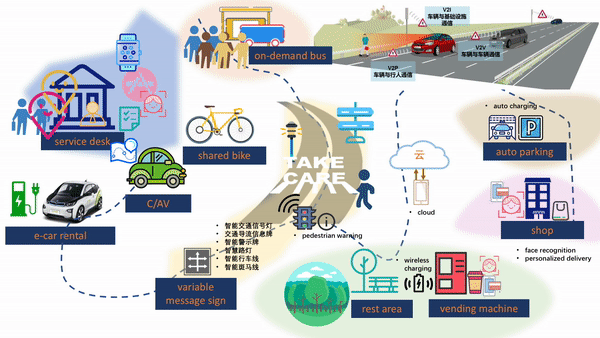

# Welcome to Xiaoqing's blog

Xiaoqing's research interests include: travel demand prediction, intelligent transportation systems, big data, behavior modeling and transportation planning.

This blog presents some of my research in transportation. 

You can find the pdf version of my resume here. [XiaoqingDAI's resume](XiaoqingDAI_resume_201806acdemic_final.pdf)

### Travel demand prediction under non-recurrent situations 

This is my current research topic. The goal is to predict travel demand under non-recurrent situations based on normal historical data. The model has been developed for metro systems. 

[//]: # (You can use the [editor on GitHub](https://github.com/XiaoqingDai/XiaoqingDai.github.io/edit/master/index.md) to maintain and preview the content for your website in Markdown files.)

[//]: # (Whenever you commit to this repository, GitHub Pages will run [Jekyll](https://jekyllrb.com/) to rebuild the pages in your site, from the content in your Markdown files.)
  
[//]: # 
[//]: # Figure. A heatmap of out-station volume of Shanghai metro on a normal day.

Figure. A heatmap of out-station volume of Shanghai metro on a heavy rainy day with disruption in the afternoon.

[//]: # ### Markdown

[//]: # Markdown is a lightweight and easy-to-use syntax for styling your writing. It includes conventions for

[//]: # For more details see [GitHub Flavored Markdown](https://guides.github.com/features/mastering-markdown/).

[//]: # ### Jekyll Themes

[//]: # Your Pages site will use the layout and styles from the Jekyll theme you have selected in your [repository settings](https://github.com/XiaoqingDai/XiaoqingDai.github.io/settings). The name of this theme is saved in the Jekyll `_config.yml` configuration file.

[//]: # ### Support or Contact

[//]: # Having trouble with Pages? Check out our [documentation](https://help.github.com/categories/github-pages-basics/) or [contact support](https://github.com/contact) and we’ll help you sort it out.

### Intelligent Transportation System Planning

Figure. A scenario of future travel in intelligent transportation system planning.

