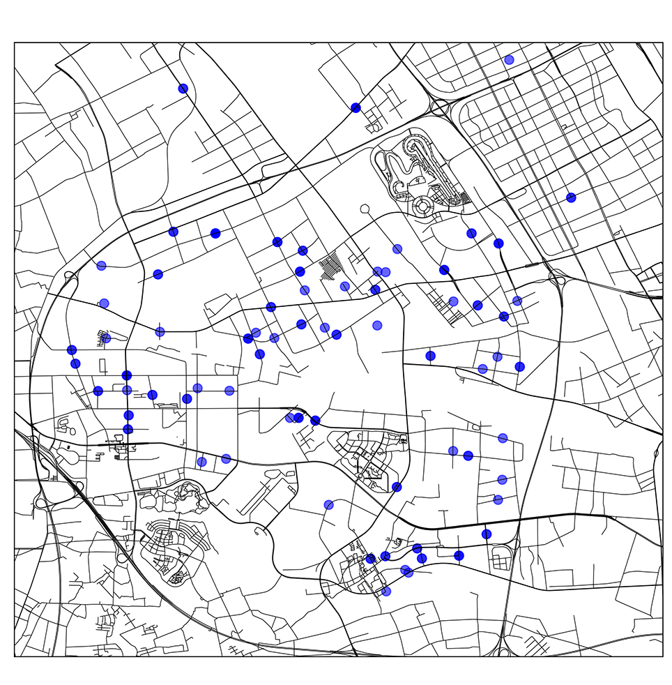

# Welcome to Xiaoqing DAI's blog

My research interests include: travel demand prediction, intelligent transportation systems, big data, behavior modeling and transportation planning.

This blog presents some of my research. 

You can find the pdf version of my resume here, as well as my contact info. [XiaoqingDAI's resume](XiaoqingDAI_resume_201806acdemic_final.pdf)

### Travel demand prediction under non-recurrent situations 

A fantastic topic. The goal is to predict travel demand under non-recurrent situations based on normal historical data. I have developed a model for metro systems. 

Figure. A heatmap of out-station volume of Shanghai metro on a heavy rainy day with disruption in the afternoon.

---

### Intelligent Transportation System Planning

A extreme practical topic. Intelligent transportation system planning based on consideration of smart connected vehicles. The V2I roadside environment design and the coordinated traffic signal control/traffic guidance system design are included.

Figure. A roadmap of the planning area.

---

### ODs are interesting.

 <iframe src="https://xiaoqingdai.github.io/javascript1/ODchord.html" width="100%" scrolling="no"  frameborder="0" height="100%" frameborder="0"></iframe> 

 
Figure. A chord map of ODs in a metro network.

 <iframe src="https://geohey.com/apps/dataviz/39e7b526c1a841b5bdfcd3bac2ce2cee/share?ak=NWNiN2MzMjFhOGE1NDNlZmE4M2UxOTJiNzU5MzFjOGM" width="100%" scrolling="no"  frameborder="0" height="100%"></iframe> 

